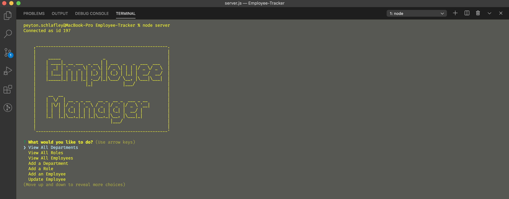
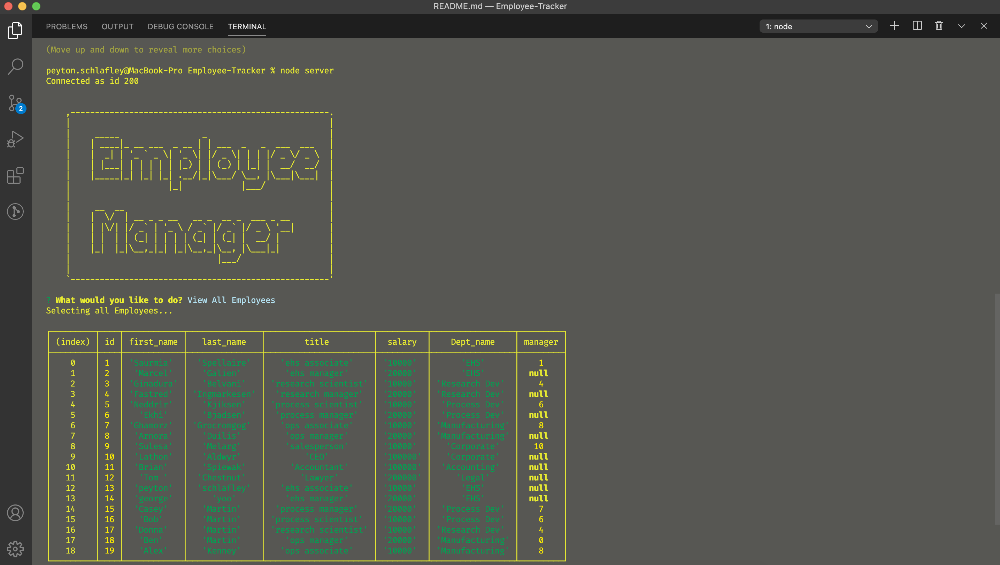

  # Employee Tracker

  
  
  ## Description
  This is an employee database where you can add an employee to the company. You can also add a department, and role for that employee. 

  ## Table of Contents

  * [Installation](#installation)
  * [Usage](#usage)
  * [Credits](#credits)
  * [License](#license)
  * [Questions](#questions)

  ## Installation
  npm install 
  
  
  ## Usage
  This application is ran using node.js and mysql. First you need to make sure you have mysql installed on your comupter and have an account. Then after you clone the repository, all you need to do is run node server.js. Then you will be prompted a number of questions to go through the application.
  
  >
  >
  
  ## License
  This app is licensed under:
  ISC  

  ## Questions
  If you have any questions you can visit my github profile at <https://github.com/>
  or you can email me at <pschlafley0@gmail.com>